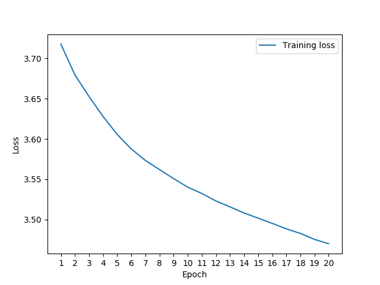

# WaveNet Keras implementation

This repository contains a basic implementation of the WaveNet as described in the paper published by DeepMind: [Oord, Aaron van den, et al. "Wavenet: A generative model for raw audio." arXiv preprint arXiv:1609.03499 (2016).](https://arxiv.org/pdf/1609.03499.pdf)

## Installation instructions

The code has only been tested and verified with Python 3.6. Assuming you have an installation of [pipenv](https://docs.pipenv.org/) for Python 3, you may clone the project, navigate to the root folder and run:

```bash
make install
```

This will most likely take care of the dependencies, unless you're using Windows.

## Reproducibility: Running the examples

In the `examples` folder you will find a small sample of data, downloaded from the [LJ Speech Dataset](https://keithito.com/LJ-Speech-Dataset/). The dataset originally contains about 24 hours of speech, but I selected just a few files to create a small proof of concept, since I ran the training on my laptop and training such a complex architecture on a huge dataset was not viable for me. I used 50 files for training and 6 for validation.

### Training

To train the network with the small amount of data provided in the package, navigate to the `examples` directory and run:

```bash
pipenv run python train_small.py
```

Feel free to also tweak the parameters and add more data, if your computational resources allow it (e.g. use AWS spot instances with GPUs). For example, I see posts around the internet that use 1000-2000 epochs. I used 20, because an order of magnitude higher would take days to train. The filter size should also probably be larger (e.g. 64), and the residual blocks should be more (but keep in mind the paper recommends dilation rate `mod9`).

In the figure below, you may see a plot of the training loss, using the default parameters currently in `wavenet.examples.train_small`. It's obvious that the model is far from saturation.




### Generating sound

Using the little network that I trained, the generated wavefile sounds like plain noise. However, if you'd like to generate your own wavefile, tweak the parameters accordingly (e.g. point to your own model) and run:

```bash
pipenv run python generate_small.py
```
